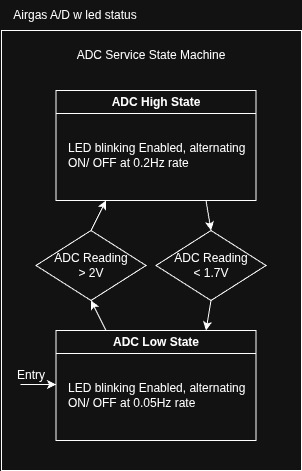

# Airgas_STM_A-D
Project for technical interview for Airgas

# Pinout
The Led is PA5, User LEDS LD1 on the silkscreen  
Q2.a's Channel 1 ADC is PA1, headers A1 (CN8-2 or CN7-30)  
Q3.a's Channel 2 ADC is PA4, headers A2 (CN8-3 or CN7-32)  
B1 USER Switch is clearly marked on the silkscreen  
Q3.a's PWM is currently mapped out to PC7 on headers PWM D3 (CN9-4 or CN10-31)  

# Requirements
1.​ Create a project (Airgas STM A/D) in github using STM32 Evaluation board  
(NUCLEO-C071RB) or equivalent STM32 eval board.  
a.​ The project shall have two branches  
i.​ Airgas A/D w led status  
ii.​ Airgas A/D w PWM  
b.​ The project shall have a tag release with hex files of branch i.  
2.​ Details of i. Airgas A/D w led status  
a.​ Read the ADC value of the channel 1, and if the value is more than 2V, set the  
status LED to blink at 0.2 Hz continuously.  
b.​ With the hysteresis of 0.3 Volts from the threshold of 2V , if the voltage is below  
1.7V blink the status LED 0.05 Hz.  
3.​ Details of ii. Airgas A/D w PWM.  
a.​ Read the ADC value of channel 2, and if the value is more than 2.5V, set the  
PWM to 100 Hz (50 % duty cycle).  
b.​ Blink the status LED to 10 Hz, when the B1 user switch is pressed more than 2  
secs.  

# 2. With Led State Machine

# 3. With PWM State Machine
_darkmode.jpg)
